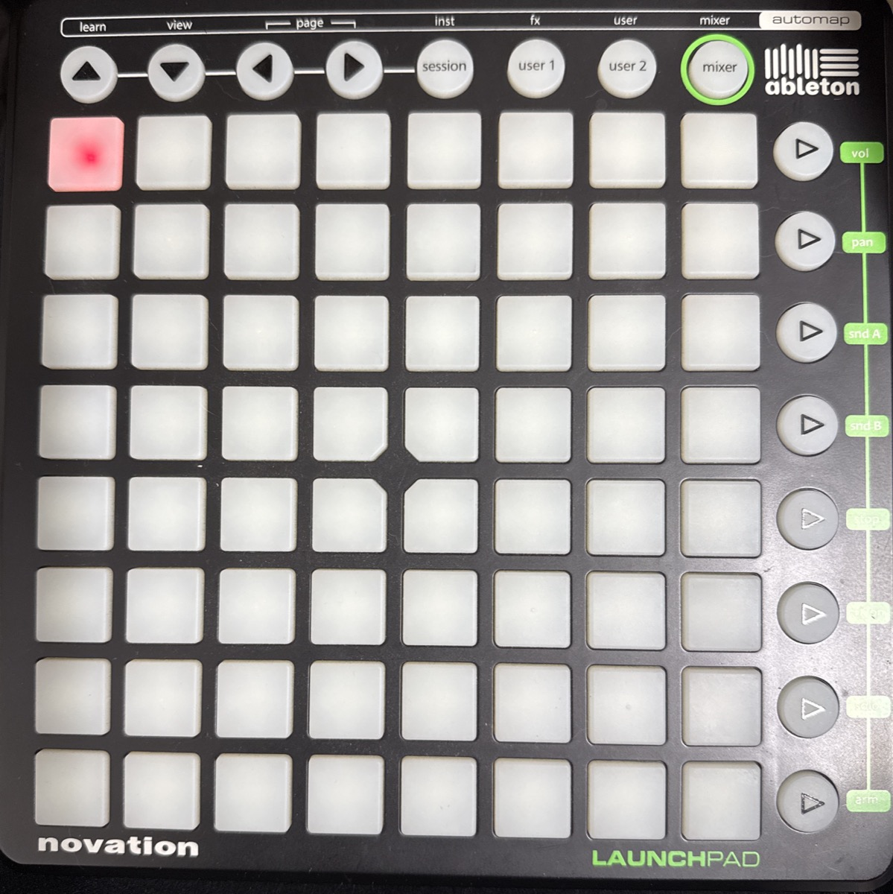

*[English](README.md)*

# Launchpad HID/USB Bridge




Novationの初代Launchpad(型番 `NOVLPD01`, USB Vendor ID `0x1235` / Product ID `0x000e`)を、
生産終了した純正ソフト「Automap」なしで、Max単体（Node for Max）から直接認識・操作するための
ブリッジ。

## 背景・分かったこと

- この個体はUSBバスには見えるが、macOSのHID/MIDIクラスドライバには一切バインドされない
  （`bInterfaceClass = 255`、ベンダー定義インターフェース。Low-Speed, 1.5Mb/s）。
  そのためAudio MIDIの設定にも、Maxの`[hid]`オブジェクトにも、`node-hid`(hidapi)にも出てこない。
- USBバスレベル(libusb)なら直接掴める。インターフェース0に、8バイト固定長のInterrupt
  エンドポイントが2つ(IN: `0x81`, OUT: `0x02`)ある。
- その生パケットの中身は**標準MIDIバイト列そのもの**（ランニングステータス付き）。Automapは
  複雑な変換をしていたわけではなく、単にこの独自トランスポートをOS標準のMIDIポートとして
  見せていただけだった。
- したがって「HIDとして認識させる」のではなく、「libusbで直接エンドポイントを読み書きし、
  ランニングステータスMIDIとしてパースする」のが正解。

## 動作環境の注意

- Node for Max（`[node.script]`）が内蔵しているNode.jsは、ターミナルの`node`コマンドとは
  **別バージョン**であることが多い。ネイティブモジュール(`usb`)はMax内蔵Node.jsのABIに
  合わせてビルド/取得する必要がある。
  - 確認方法: `node.script node_version_probe.js` を使うと、Maxコンソールに
    `Node version` / `ABI (NODE_MODULE_VERSION)` / `Platform/arch` が出る。
  - 一致させる方法: 該当バージョンのNode.js tarballを一時的にダウンロードしPATHに通した
    状態で`npm install usb`をやり直す（`npm rebuild --target=...`は最新npmでは
    効かないことがあるため非推奨）。
    ```
    curl -O https://nodejs.org/dist/vX.Y.Z/node-vX.Y.Z-darwin-arm64.tar.gz
    tar -xzf node-vX.Y.Z-darwin-arm64.tar.gz
    export PATH="$(pwd)/node-vX.Y.Z-darwin-arm64/bin:$PATH"
    node -v   # 確認
    rm -rf node_modules/usb && npm install usb
    ```
- `[node.script ...]`オブジェクトは、作成しただけでは動かない。**`script start`メッセージを
  明示的に送るまでスクリプトは実行されない**（`launchpad_node_hid.maxpat`ではloadbangで
  自動送信するようにしてある）。

## 別のパソコンで使う場合

### Intel Mac

このブリッジ自体が不要な可能性が高い。実際に検証したIntel Mac(Big Sur)では、何も
インストールしなくても「Audio MIDIの設定」→「MIDIスタジオを表示」でLaunchpadが
そのままMIDI機器として認識された（Apple純正のUSBドライバ側に、この古いLow-Speed機器を
拾う互換性がまだ残っていたと見られる）。まずは何もせずAudio MIDIの設定を確認し、
出ていればAbleton Live等から普通のMIDI機器として直接使える。

### 別のApple Silicon Mac

同じ手順が必要。ゼロからではなくこのリポジトリをそのまま使える。

```
git clone https://github.com/pb5/launchpad-usb-bridge.git
cd launchpad-usb-bridge
npm install
```

そのMacのMaxが内蔵しているNode.jsバージョンは異なる可能性があるため、上記
「動作環境の注意」の手順で`node_version_probe.js`を使って確認し、ズレていたら
`usb`を該当バージョン向けに入れ直す。

### Windows PC

未検証。WindowsはHIDでもMIDIでもない「ベンダー定義インターフェース」に対して
標準では汎用ドライバを自動で割り当てないため、libusb経由で掴むには**Zadig**という
ツールで該当デバイス(Vendor ID `0x1235` / Product ID `0x000e`)にWinUSBドライバを
手動で割り当てる必要が出てくる可能性が高い。試す場合は個別に手順を検討すること。

## Maxをアップデートした場合の注意

Node for MaxはMaxアプリ自体に内蔵されているため、**Maxをアップデートすると内蔵Node.jsの
バージョンも一緒に変わることがある**。今回このブリッジが動かなかった根本原因も、
Max内蔵Node.js(v22.18.0 / ABI127)とターミナルのNode.js(v24.18.0)のバージョン違いだった。

Maxをアップデートした後に急に`usb`が動かなくなったら(「Node script not ready」のまま
固まる、または`require('usb')`のエラーが出る)、以下の手順を踏む。

1. パッチに`[node.script node_version_probe.js]`オブジェクトを追加し、`script start`
   メッセージを送って、Maxコンソールで新しいNode.jsバージョンを確認する
2. そのバージョンのNode.js tarballを一時的にダウンロードしPATHに通した状態で、
   `launchpad_hid_bridge`フォルダで`usb`を入れ直す
   ```
   curl -O https://nodejs.org/dist/vX.Y.Z/node-vX.Y.Z-darwin-arm64.tar.gz
   tar -xzf node-vX.Y.Z-darwin-arm64.tar.gz
   export PATH="$(pwd)/node-vX.Y.Z-darwin-arm64/bin:$PATH"
   node -v
   rm -rf node_modules/usb && npm install usb
   ```
3. Maxを再起動してパッチを開き直す

逆に言えば、Maxのバージョンを固定して使い続けている限りは、一度動けばずっと動く。
壊れるとしたらMaxをアップデートした時だけ。

## ファイル

- `launchpad_bridge.js` — 本体。`open`/`close`/`send status data1 [data2]`のメッセージに対応。
  受信したMIDIは`['midi', status, data1, data2]`としてoutlet。
- `launchpad_node_hid.maxpat` — 上記を使うMaxパッチ（デコード結果の表示、LEDテストボタン付き）。
- `usb_probe.js` / `launchpad_raw_read.js` / `node_version_probe.js` — 解析に使った
  ターミナル単体で動く診断用スクリプト（Maxを介さず`node xxx.js`で直接実行できる）。

## MIDIマッピング表

### グリッド (8×8パッド)

`Note = 16 × row + col`。row0が丸ボタン(自動マップ列)側の最上段、row7が手前(USBコネクタ側)の最下段。
すべて **Note On/Off (status = 144 / 128, ch.1)**。

| row\col | 0 | 1 | 2 | 3 | 4 | 5 | 6 | 7 |
|---|---|---|---|---|---|---|---|---|
| 0 (上端) | 0 | 1 | 2 | 3 | 4 | 5 | 6 | 7 |
| 1 | 16 | 17 | 18 | 19 | 20 | 21 | 22 | 23 |
| 2 | 32 | 33 | 34 | 35 | 36 | 37 | 38 | 39 |
| 3 | 48 | 49 | 50 | 51 | 52 | 53 | 54 | 55 |
| 4 | 64 | 65 | 66 | 67 | 68 | 69 | 70 | 71 |
| 5 | 80 | 81 | 82 | 83 | 84 | 85 | 86 | 87 |
| 6 | 96 | 97 | 98 | 99 | 100 | 101 | 102 | 103 |
| 7 (下端) | 112 | 113 | 114 | 115 | 116 | 117 | 118 | 119 |

### 右端の丸ボタン (シーン起動、8個)

グリッドの9列目にあたる。col=8として同じ式 `16 × row + 8`。こちらも **Note On/Off**。

| row | 0 | 1 | 2 | 3 | 4 | 5 | 6 | 7 |
|---|---|---|---|---|---|---|---|---|
| Note | 8 | 24 | 40 | 56 | 72 | 88 | 104 | 120 |

### 上段の丸ボタン (8個、Automap/Liveボタン)

こちらは **Control Change (status = 176, ch.1)**。左から右の順。

| ボタン | Up | Down | Left | Right | Session | User 1 | User 2 | Mixer |
|---|---|---|---|---|---|---|---|---|
| CC番号 | 104 | 105 | 106 | 107 | 108 | 109 | 110 | 111 |

Ableton Live純正のコントロールサーフェススクリプトが有効な環境では、これらは
Vol/Pan/SndA/SndB/Stop/TrackOn/Solo/Armのように機能が上書き表示されることがあるが、
生のMIDI番号(CC104-111)自体は固定。

### ベロシティ/値 = LEDの色 (共通)

グリッド・シーンボタンはNote On、上段ボタンはCCで、どちらもvelocity/value部分で色を指定する。

| 値 | 色 |
|---|---|
| 12 | 消灯 |
| 15 | 赤(フル) |
| 60 | 緑(フル) |
| 63 | 黄/アンバー(フル) |

赤・緑それぞれ2bitの輝度(0-3)を持つので、上記4つ以外の中間の明るさも指定可能
（値 = 16×green(0-3) + 8(copy) + 4(clear) + red(0-3)）。

## 使い方

`launchpad_node_hid.maxpat`を参照。要点だけ:

1. 初回のみ: `npm install`（Max内蔵Node.jsとのABIが合わない場合は上記の手順で`usb`を入れ直す）
2. パッチを開く → loadbangが`script start`を自動送信
3. `open`メッセージをクリック
4. Launchpadのボタンを押すと`route midi`以下にデコード結果が出る
5. `send <status> <data1> <data2>`メッセージでLEDを制御できる
   (例: `send 144 0 15` で左上パッドを赤点灯)
